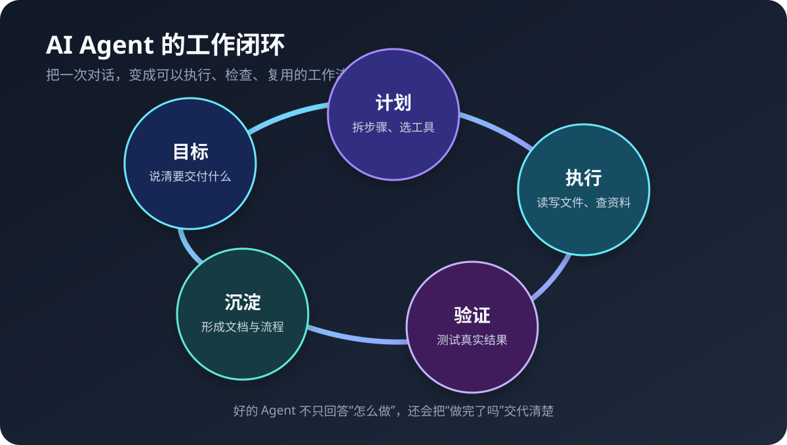
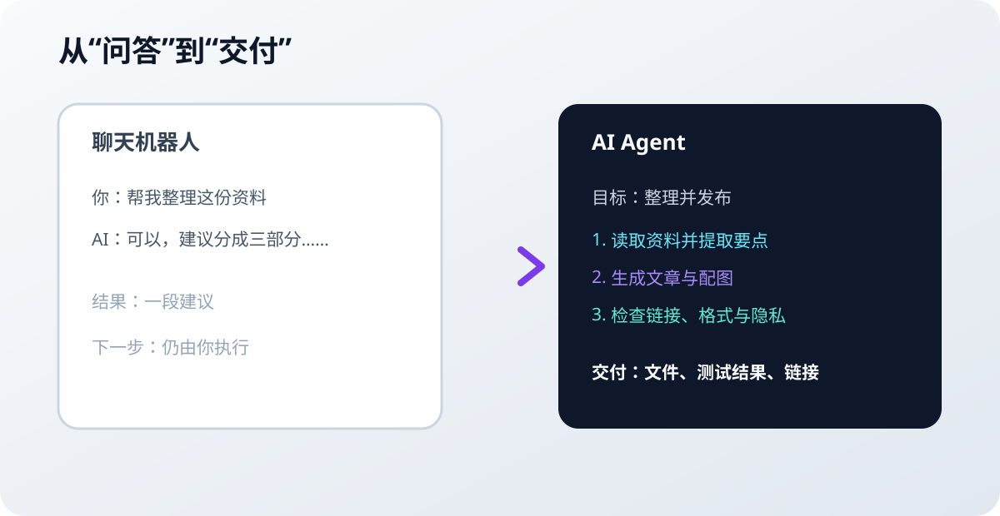

# 为什么值得订阅 AI Agent：从聊天工具到真正的工作伙伴

很多人第一次使用 AI，是在聊天框里问一个问题：翻译一段话、解释一段代码、帮忙写一封邮件。这个体验已经很好，但它仍然像是在雇一个“会回答问题的人”。

AI Agent 更进一步：它能理解一个目标，拆成步骤，调用搜索、文件、代码和自动化工具，执行任务，再把结果交付给你。你不需要把每一步都盯着，也不需要在十几个应用之间来回复制粘贴。

这也是订阅 AI 工具最实际的理由：你买的不是更多聊天次数，而是把一部分重复工作交给一个可以持续使用的工作系统。

## 先说结论：什么时候值得订阅

如果你每周都会遇到下面的事情，付费 AI 工具通常很快就能体现价值：

- 反复写邮件、摘要、报告、会议纪要或产品文案；
- 需要搜索资料、对比多个来源，再整理成结论；
- 经常修改代码、写测试、查日志、维护配置文件；
- 有大量文件、表格、图片或 PDF 需要分类和提取；
- 想把“每天检查一次”“每周汇总一次”这类工作自动化；
- 需要一个熟悉项目背景、写作风格和工作约定的长期助手。

如果只是偶尔问几个简单问题，免费方案往往够用。订阅的价值取决于节省的时间，而不是模型页面上有多少功能按钮。

## AI Agent 和普通聊天机器人差在哪里

聊天机器人通常以“输入一段话，返回一段话”为主。Agent 则围绕“完成一个目标”工作。

| 对比项 | 普通聊天机器人 | AI Agent |
|---|---|---|
| 工作单位 | 一轮问答 | 一个目标或任务 |
| 信息来源 | 主要依赖对话上下文 | 可按权限使用网页、文件、代码库和工具 |
| 执行方式 | 给出建议，由人继续操作 | 规划并执行多个步骤 |
| 结果形态 | 文字回答 | 文件、修改、报告、链接或自动化结果 |
| 验收方式 | 读起来是否合理 | 是否实际完成、测试是否通过、链接是否可用 |
| 长期价值 | 一次性解决问题 | 把流程沉淀为技能、模板或定时任务 |

Agent 并不是“更聪明所以什么都不用管”。恰恰相反，越是能操作真实文件和系统，越需要权限边界、测试和人工确认。好的 Agent 会把做了什么、没做什么、如何验证说清楚，而不是只给一个听起来很确定的答案。

## 五个最容易感受到的优势

### 1. 从“想法”直接走到“成品”

普通工具可以帮你起草一篇文章，但你仍要自己找图、改格式、检查链接、提交仓库。Agent 可以把这些步骤串起来：先整理素材，再生成文章和插图，做一次隐私扫描，最后提交并返回结果。

任务越接近一个完整交付物，Agent 的优势越明显。

### 2. 把重复操作变成稳定流程

如果你每次都用相同的方式处理日志、发布文档或检查项目，可以把这套方法写成技能或脚本。以后只需要说清楚目标，Agent 就能按照同一套规则执行。

这比“每次重新解释一遍”可靠，也比把流程只存在某个人脑子里更容易交接。

### 3. 能跨工具工作，而不是困在一个输入框里

真实任务很少只需要文字。它可能同时涉及浏览器、终端、Git、Markdown、图片、日历或消息平台。Agent 的价值在于连接这些工具，把上下文带到下一步。

例如，一次产品调研可以包含：搜索官方资料、抓取页面、整理对比表、写成文章、生成配图，再把最终页面发布出去。人负责方向和判断，Agent 负责大量机械操作。

### 4. 更适合长任务和复杂问题

复杂任务最消耗人的地方，往往不是某一个难点，而是中间几十个小步骤：找文件、确认版本、记住限制、处理异常、回头验证。Agent 可以维护任务上下文，按阶段推进，并在遇到真正需要决定的地方停下来询问。

这让人从“操作员”变成“负责人”：决定目标、批准高风险动作、检查最终结果。

### 5. 每次使用都在积累自己的工作系统

好的 AI 工具不会只留下聊天记录。它还可以沉淀：

- 适合自己的提示词和任务模板；
- 可复用的技能与自动化脚本；
- 项目的公开文档和决策记录；
- 对输出质量的检查清单；
- 哪些动作必须人工确认的边界。

时间久了，你得到的不只是一个聊天账号，而是一套越来越懂你工作方式的工具链。

## 哪些人最适合订阅

### 开发者和技术人员

AI Agent 可以帮助检查代码库、定位错误、编写测试、生成文档、执行构建，并在修改后查看真实输出。它特别适合处理“需要读很多文件，但每个文件都不难”的工作。

需要注意的是：代码能运行，不代表逻辑正确。Agent 生成的修改仍然要经过测试、diff 审查和必要的人工验证。

### 独立创作者和小团队

一个人同时做研究、写作、设计、运营和发布时，最容易被流程性工作拖住。Agent 可以把资料整理、文章初稿、图片说明、格式检查和发布准备串成一条流水线，让小团队少一些复制粘贴。

### 需要管理大量资料的人

研究报告、会议记录、合同草稿、产品文档和知识库，通常需要先提取、再分类、再建立关系。Agent 能帮助完成第一轮整理，把人的时间留给判断和取舍。

### 想把 AI 用得更深的普通用户

不需要会编程才能使用 Agent。只要你有一个明确的重复任务，例如每周整理账单、汇总阅读笔记、维护个人知识库，就可以从小流程开始。先让它只读和生成草稿，熟悉后再逐步开放写入和自动执行权限。

## 如何判断一款 AI 工具是否值得付费

不要只看模型名称或宣传页。可以用下面六个问题做试用期检查：

1. **它能不能接触真正的工作资料？** 如果每次都要手工复制一小段内容，复杂任务的收益会很低。
2. **它能不能调用工具？** 搜索、文件、终端、代码库或自动化能力，决定了它能否从建议走到交付。
3. **它是否会报告验证结果？** “已经完成”应该对应文件、测试输出、链接或其他可检查证据。
4. **权限和隐私是否说得清楚？** 重要资料不应在不清楚去向的情况下上传，更不能把密钥交给不需要它的任务。
5. **长任务是否稳定？** 观察它是否能处理失败、保留上下文，并在需要决定时停下来。
6. **它是否适合你的工作方式？** 终端、桌面、网页和消息平台各有优缺点，顺手比参数表更重要。

## 一个低风险的入门方法

不要一开始就让 Agent 管理全部文件。用一个可回滚的小任务做测试：

> 请读取这个目录中的公开 Markdown 文件，整理出一篇文章大纲。不要修改原文件，不要访问目录外的文件。完成后列出读取过的文件、提纲和你没有确认的地方。

如果结果令人满意，再升级任务：

> 根据已经确认的大纲生成新文章，图片使用公开素材或自绘 SVG。写入指定的新文件，先检查链接和敏感信息，再告诉我文件路径与检查结果。不要修改其他文件。

这种方式有三个好处：范围清楚、失败容易回滚、每一步都有证据。先建立信任，再增加权限，比一开始追求“全自动”更安全。

## 订阅建议：按工作量选择，而不是追逐参数

可以把 AI 工具分成三种使用方式：

- **偶尔使用**：免费聊天工具，解决临时问答和简单改写。
- **稳定使用**：订阅一个主力模型，用于写作、研究、文件分析和日常工作。
- **重度使用**：在主力模型之外，再选择一个能连接本地工具、代码库或自动化流程的 Agent。

大多数人不需要同时订阅很多服务。先选一个最符合自己工作流的工具，连续使用两周，记录它实际节省了多少时间、哪些任务仍然需要返工，再决定是否增加其他订阅。

如果你想了解 Agent 的实际工作方式，可以从 [Hermes Agent 官方文档](https://hermes-agent.nousresearch.com/docs/) 开始；它的 [GitHub 仓库](https://github.com/NousResearch/hermes-agent) 适合继续了解工具能力、安装方式和扩展边界。选择其他服务时，也建议优先阅读官方文档和隐私政策，不要只依据短视频或营销截图。

## 最后：把 AI 当成同事，但不要把判断外包出去

AI Agent 最有价值的地方，不是它能写出一段漂亮文字，而是它能把一个模糊目标推进成一组可检查的结果。它可以替你处理大量重复劳动，却不能替你承担所有判断：哪些资料可信、哪些改动有风险、什么结果才算完成，仍然需要人负责。

值得订阅的工具，应该让你更快地完成重要工作，同时让过程更透明、更容易复查。试着拿一个真实但低风险的小任务开始。如果它能稳定地帮你完成，而不是只让你多读几段答案，那么这笔订阅费用就有了清晰的回报。

## 延伸阅读

- [[hermes-agent/使用指南|Hermes Agent 使用指南]]：核心能力、常见任务方式和结果验收原则
- [[hermes-agent/隐私与公开知识库边界|隐私与公开知识库边界]]：公开资料、个人资料和敏感信息的分界
- [Hermes Agent 官方文档](https://hermes-agent.nousresearch.com/docs/)
