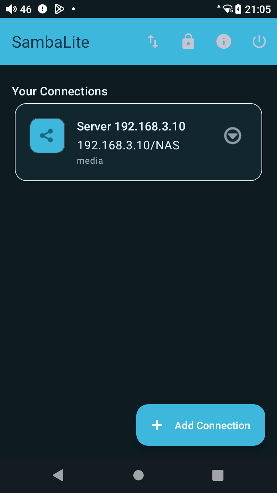
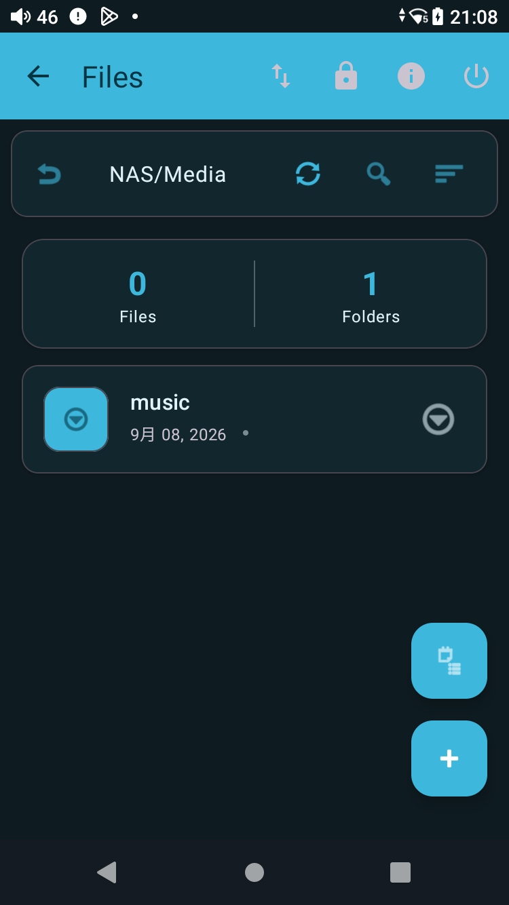
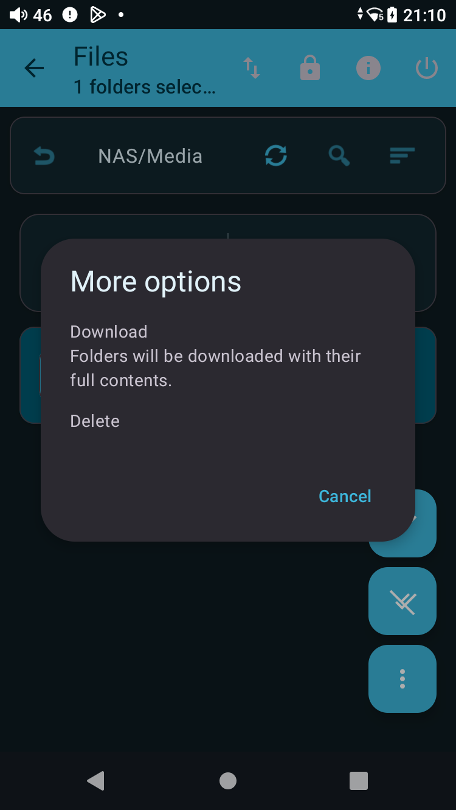
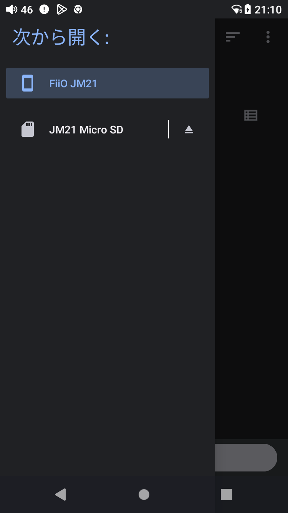
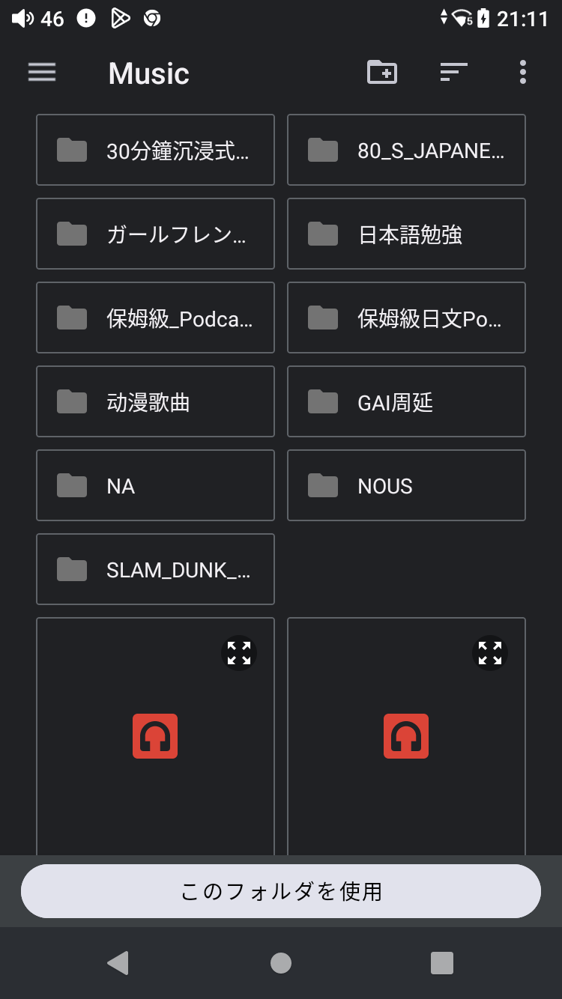
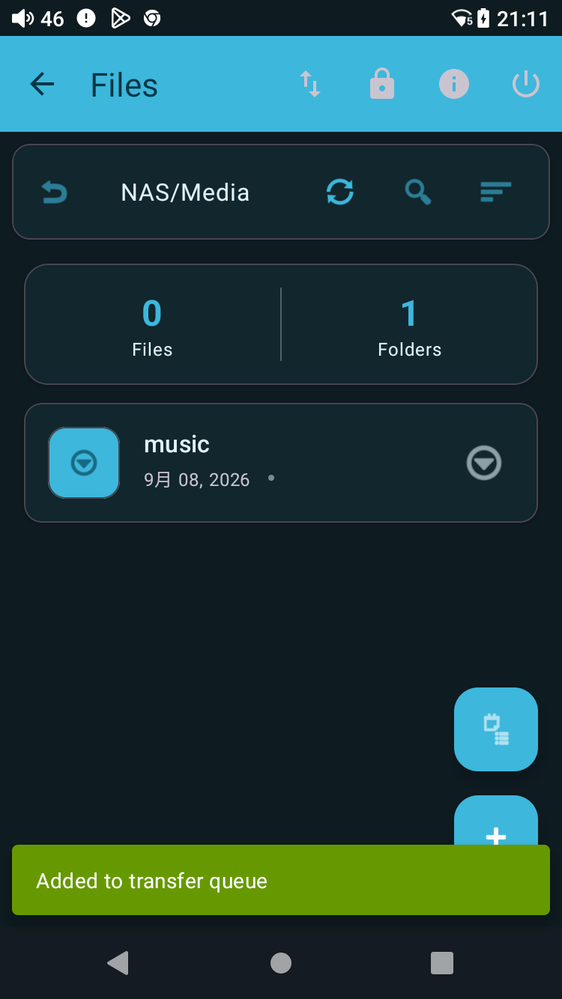
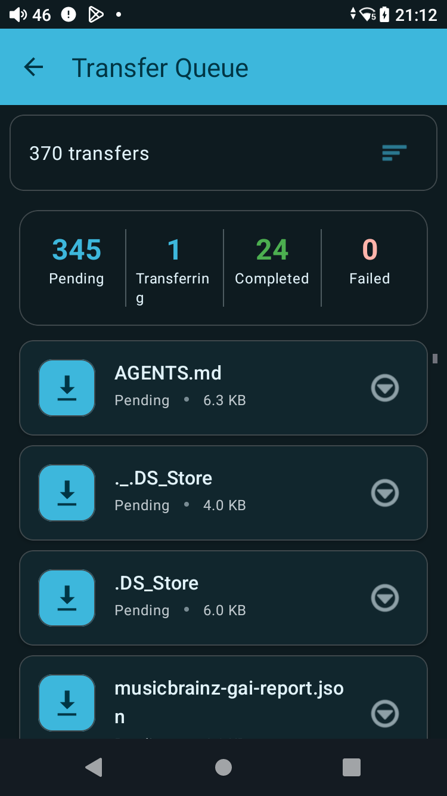

# SambaLite：从 NAS 下载音乐到 FiiO JM21 TF 卡

这篇记录的是一次真实完成的配置。目标是：让 FiiO JM21 上的 SambaLite 使用 NAS 的 `media` 账号，访问 `NAS/Media/music`，再把整个音乐目录递归下载到 TF 卡的 `Music` 目录。

密码不写进 Wiki。本文只记录账号名和路径；实际输入时使用 NAS 当前保存的密码。

## 一、最终配置

```text
NAS
└── SMB server: 192.168.3.10
    └── Share: NAS
        └── Media/music
            ├── 音乐文件
            └── 音乐子目录
                    │
                    │ SambaLite：Download，递归下载
                    ▼
FiiO JM21
└── TF 卡 /Music
    ├── 原有音乐
    └── 从 NAS 下载的文件和目录
```

SambaLite 连接参数：

```text
Server:          192.168.3.10
Share Name:      NAS
Default folder:  Media/music
Username:        media
Password:        不写入文档，使用 NAS 当前保存的密码
本地目标:         TF 卡 /Music
```

这里的 `Share Name` 和 `Default folder` 必须分开理解：`NAS` 是 SMB 共享名，`Media/music` 是共享里面的路径。不能把完整路径 `NAS/Media/music` 填进 Share Name。



## 二、这次实际改了什么

### NAS 端

NAS 端已经完成这些准备工作：

- 新增或启用 SMB 账号 `media`；
- `media` 可以访问 `NAS/Media`；
- `NAS/Media/music` 已授予读写权限；
- 用 `media` 验证过目录访问和创建/删除目录；
- Navidrome 使用 NAS 上的 `Media/music` 音乐目录。

Wiki 不记录密码，也不记录任何会话或密钥。NAS 端以后如果改了密码，需要同步修改 SambaLite 连接里的 Password 字段。

### 手机端

手机上的 SambaLite 做了这些修改：

- 旧账号 `music` 改为 `media`；
- 旧密码替换成 `media` 账号当前保存的密码；
- 共享从旧的 `Music` 改为 `NAS`；
- Default folder 改为 `Media/music`；
- 连接后实际显示路径 `NAS/Media/music`；
- 本地下载目录选择 TF 卡的 `Music` 文件夹；
- 没有开启 Mirror，也没有执行删除操作。


## 三、为什么之前会显示空目录

之前 SambaLite 能打开 `NAS/Media/music`，但显示 `0 个文件、0 个文件夹`。原因不是音乐消失，而是连接仍然使用旧的 `music` 账号和旧密码组合。

改成：

```text
Username: media
Password: media 账号当前保存的密码
```

重新连接后，SambaLite 实际看到：

```text
NAS/Media/music
1 个文件
9 个文件夹
```

这说明认证和目录权限已经正常。文件数量会随 NAS 内容变化，不能把本次数字当成固定值。



## 四、如何检查 ADB 和手机存储

电脑端先确认设备：

```bash
adb devices -l
```

状态必须是 `device`。如果是 `unauthorized`，需要在手机上允许 USB 调试；如果是 `offline`，重新插拔 USB 或重启 ADB。

检查手机存储：

```bash
adb shell 'ls -ld /storage/external_sd /storage/external_sd/Music /sdcard/Music'
```

本次实际使用：

```text
TF 卡: /storage/external_sd
TF 卡音乐目录: /storage/external_sd/Music
```

不要把 `/sdcard/Music` 和 TF 卡 `/storage/external_sd/Music` 混淆。Android 文件选择器里，TF 卡显示为 `JM21 Micro SD`。

## 五、首次下载的完整操作

当前 SambaLite 版本的实际菜单显示为 `Download`，不是文档中有时提到的 `Setup Sync`。因此这次采用一次性递归下载：它会把选中的远程文件夹及其子目录加入传输队列。

### 1. 打开连接

打开 SambaLite，点击连接卡片：

```text
Server 192.168.3.10
192.168.3.10/NAS
media
```

连接后会直接进入：

```text
NAS/Media/music
```

### 2. 回到 Media，选中 music 文件夹

点击文件浏览器左上方的返回上级目录按钮，回到：

```text
NAS/Media
```

此时应看到一个远程文件夹：

```text
music
```

长按 `music`，让它进入选择状态。不要直接进入文件夹后再选零散文件。

### 3. 打开更多操作并选择 Download

选择状态下，点击右下角的三个点，菜单会出现：

```text
Download
Folders will be downloaded with their full contents.
Delete
```

选择 `Download`。这里的 Download 是从 NAS 下载到手机，`Delete` 则是远程删除，千万不要误点。



### 4. 选择 TF 卡 Music 目录

Android 系统文件夹选择器第一次可能默认打开手机内部存储：

```text
FiiO JM21 > Music
```

这不是目标位置。点击左上角汉堡菜单，在存储位置中选择：

```text
JM21 Micro SD
```



进入 TF 卡后，找到并打开：

```text
JM21 Micro SD/Music
```

必须进入 `Music` 文件夹里面，不能停留在 TF 卡根目录。Android 为了保护存储，通常不允许直接授权整个 TF 卡根目录。



点击底部：

```text
このフォルダーを使用（使用此文件夹）
```

再点击系统授权对话框中的：

```text
許可（允许）
```

这一步只是授权 SambaLite 使用 TF 卡的 `Music` 目录，不会删除已有音乐。

### 5. 确认任务已经加入队列

授权后，SambaLite 会返回文件浏览器，并提示：

```text
Added to transfer queue
```



## 六、如何查看下载进度

点击右上角的传输队列图标，进入 `Transfer Queue`。重点看四个统计：

```text
Pending       等待传输
Transferring  正在传输
Completed     已完成
Failed        失败
```

本次开始后曾看到：

```text
370 transfers
345 Pending
1 Transferring
24 Completed
0 Failed
```

这表示任务已经在工作，不是卡死。选中远程文件夹后，SambaLite 会递归展开其中的子目录，所以任务总数可能在开始后继续增加。



正常完成的判断标准：

```text
Pending       = 0
Transferring  = 0
Failed        = 0
```

不要看到 Pending 很大就重复点击 Download，否则可能建立重复任务。首次音乐库下载很久是正常的，期间可以离开 SambaLite；如果需要确认后台状态，再回到 Transfer Queue 查看。

## 七、以后 NAS 地址、账号或密码改变时怎么改

### 只改密码

1. 回到 SambaLite 首页；
2. 点击连接卡片右侧的下拉箭头；
3. 选择 `Edit`；
4. 滚动到 `Authentication`；
5. 修改 Password；
6. 点击底部 `Test Connection`；
7. 测试成功后点击 `Save`；
8. 重新打开连接，确认能看到 `NAS/Media/music`。

### 改账号

路径不变时，只修改：

```text
Username: 新账号
Password: 新账号密码
```

本次从 `music` 改为 `media` 就是这个流程。账号改完后一定要点 `Test Connection`，不要只看保存是否成功。

### NAS 目录改名或移动

例如从：

```text
NAS/Music
```

移动到：

```text
NAS/Media/music
```

则 SambaLite 应该设置为：

```text
Share Name: NAS
Default folder: Media/music
```

不要写成 `Share Name: NAS/Media/music`，也不要把 `Media/music` 填进 Server。修改后必须重新连接并检查顶部路径。

## 八、以后更换 TF 卡或本地目录怎么改

1. 在 Android 文件夹选择器中确认新卡的名称；
2. 进入新卡的 `Music` 文件夹；
3. 重新执行一次 Download；
4. 点击 `Use this folder` 并授权；
5. 观察 Transfer Queue 是否开始出现任务。

SambaLite 使用的是 Android 授权目录，不应手动猜测路径。ADB 下看到的路径可能是 `/storage/external_sd/Music`，但 Android 文件选择器里显示的是 `JM21 Micro SD/Music`。

## 九、关于 Folder Sync 和 Mirror Mode

官方说明中的 Folder Sync 可以配置：

```text
Sync Direction: Remote → Local
Sync Interval: Manual only（第一次测试）
Mirror Mode: Off
Local Folder: TF 卡 Music 或其专用子目录
```

但本次手机上实际安装的 SambaLite 界面，在远程文件夹长按菜单中只显示 `Download` 和 `Delete`，没有显示 `Setup Sync`。因此这次没有虚构“已配置定时同步”，实际执行的是递归 Download。

如果以后升级 SambaLite 后出现 `Setup Sync`：

1. 长按远程 `music` 文件夹；
2. 选择 `Setup Sync`；
3. 方向选择 `Remote → Local`；
4. 本地目录选择 TF 卡 `Music`；
5. 间隔先选 `Manual only`；
6. Mirror Mode 保持关闭；
7. 保存后手动执行一次 `Sync Now`；
8. 确认行为正常后，再考虑每小时或每天运行。

第一次不要开启 Mirror Mode。开启后，NAS 上的删除和重命名可能传播到手机本地，必须先确认这是你想要的镜像行为。

官方说明：[SambaLite Folder Synchronization User Guide](https://github.com/egdels/SambaLite/blob/main/docs/sync_user_guide.md)。

## 十、常见问题排查

### 连接成功但显示 0 个文件

先不要改路径。检查账号是否是 `media`、密码是否正确、Share Name 是否是 `NAS`、Default folder 是否是 `Media/music`，然后重新点 `Test Connection`，必要时完全退出并重新打开 SambaLite。

### 连接卡在登录或提示 credentials

说明账号或密码不对，或者 NAS 端尚未给该账号授权。先在 NAS 端验证 `media` 能列目录，再在 SambaLite 重新填写 Password。

### 下载到了手机内部存储

检查系统文件夹选择器顶部位置。如果显示 `FiiO JM21`，说明仍在内部存储；应从左侧存储列表切换到 `JM21 Micro SD`，再进入 `Music`。

### Download 和 Sync 的区别

本次使用的是：

```text
手动选择远程文件夹 → Download → 传输队列
```

它适合首次拷贝和手动补充，不等于已经配置了定时 Folder Sync。是否支持 Folder Sync，以手机上实际出现的菜单为准。

### 如何确认本地文件真的增加了

ADB 只读检查：

```bash
adb shell 'du -sh /storage/external_sd/Music'
adb shell 'find /storage/external_sd/Music -type f | head'
```

确认下载完成后，再打开 Gramophone、Auxio 等播放器等待媒体库扫描。SambaLite 显示下载完成，不代表每个播放器会立即刷新媒体库。

## 十一、本次最终状态

```text
NAS:       192.168.3.10/NAS
账号:      media
远端目录:  NAS/Media/music
本地目录:  TF 卡 /Music
操作:      递归 Download
Mirror:    未开启
失败数:    0（开始下载时）
```

这篇文档的重点是：先把 NAS 端权限、SambaLite 账号和远端路径对齐；确认手机能看到远端文件后，再选择 TF 卡目录并执行 Download。以后改账号、密码、路径或 TF 卡时，按对应章节修改和测试即可。
