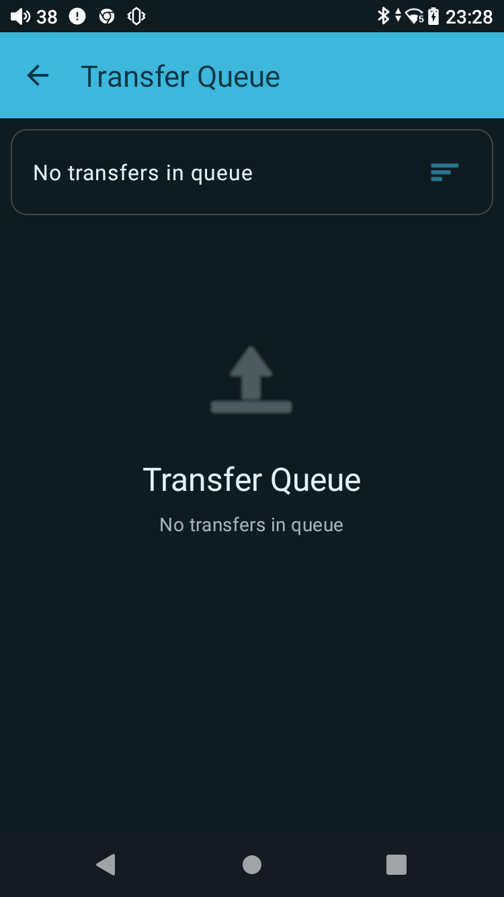
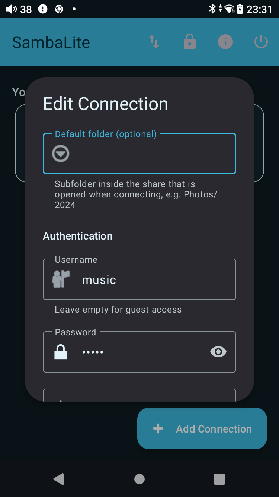
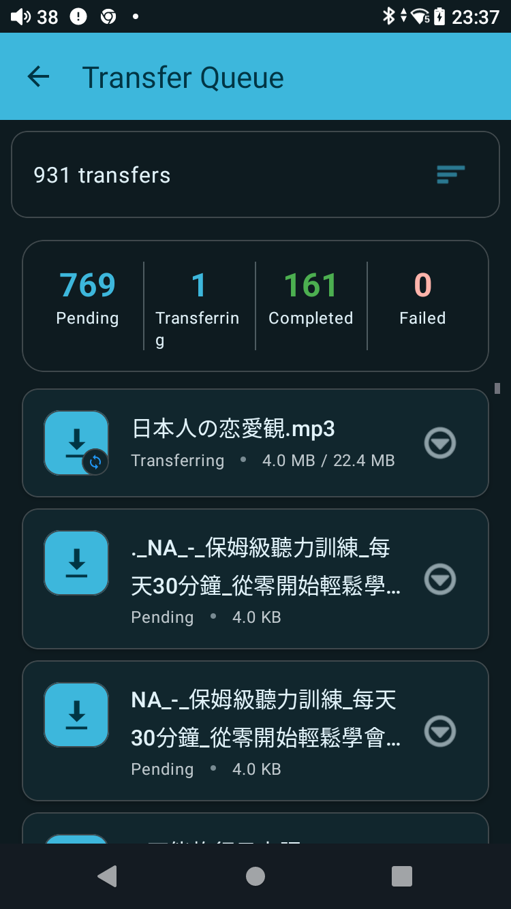

# SambaLite：把 NAS 音乐下载到 Android 手机

这篇记录的是一次真实完成过的操作：使用 SambaLite 连接 NAS 的 SMB 共享，然后把共享里的文件和子目录一次性下载到 Android 手机的本地 `Music` 目录。

设备是 FiiO JM21，NAS 地址是 `192.168.3.10`，SMB 共享名是 `Music`。密码等敏感信息不写入知识库。

> 这次实际执行的是一次性 `Download`，不是已经配置好的定时 `Folder Sync`。如果只是想先把 NAS 音乐拷到手机，使用“全选 → Download”最直接；如果要以后自动增量同步，再看后面的 Folder Sync 章节。

## 一、最终目录关系

这次使用的目录关系如下：

```text
NAS（192.168.3.10）
└── SMB share: Music
    ├── 音乐文件
    └── 多个音乐子目录
             │
             │ SambaLite：Download，递归包含子目录
             ▼
Android 手机
└── Internal storage / Music
    ├── 手机原有音乐
    └── 从 NAS 下载的文件和目录
```

理想情况下，也可以在手机 `Music` 下面预先建立一个专用目录：

```text
Internal storage/Music/NAS
```

这样 NAS 内容不会和手机原来的音乐混在一起。但本次操作中，Android 文件夹选择器的新建目录输入框没有接受 ADB 输入，最后授权使用了现有的 `Music` 目录，所以本次下载目标是 `Music` 根目录。

## 二、确认 ADB 连接

在电脑端执行：

```bash
adb devices -l
```

看到类似下面的结果，就表示手机已经被 ADB 正确识别：

```text
List of devices attached
<device-id>    device usb:... product:bengal_515 model:FiiO_JM21 device:bengal_515
```

关键是状态必须是 `device`：

```text
device       正常连接
unauthorized 手机没有授权这台电脑
offline      设备暂时不可用
```

## 三、SambaLite 的初始状态

第一次打开时，SambaLite 进入的是 `Transfer Queue` 页面。这里显示的是“传输任务队列”，不是 NAS 文件浏览器；没有任务时会显示 `No transfers in queue`。



因此，看到这个页面并不代表 NAS 没有文件，只代表还没有发起上传或下载任务。点击左上角返回，回到 SambaLite 首页。

## 四、检查 SMB 连接

首页的 `Your Connections` 中可以看到已经配置好的连接：

```text
Server 192.168.3.10
192.168.3.10/Music
user: music
```

点击连接卡片进入文件浏览器。进入后可以看到 NAS 共享中的文件和文件夹，并能看到当前路径：

```text
Music
```

本次检查到的共享根目录大约包含：

```text
Music
├── 23 个文件
└── 11 个文件夹
```

文件数量会随 NAS 内容变化，不要把这里的数字当成固定配置。

## 五、为什么之前找不到 Setup Sync

SambaLite 官方 Folder Sync 的入口是：

1. 进入连接的文件浏览器；
2. 找到需要同步的远程文件夹；
3. 长按这个文件夹；
4. 在菜单中选择 `Setup Sync`。

本次连接有一个容易误解的地方：连接配置中的 `Default folder` 原来写成了 `Music`。这表示“打开连接时直接进入 Music”，而不是在共享根目录里显示一个可以长按的 `Music` 文件夹。

连接编辑页面中的这一项如下：



如果需要给整个 `Music` 共享建立 Folder Sync，应该让连接从共享根目录打开，然后让 `Music` 作为一个普通远程文件夹出现。可是 SMB 的 `Music` 在本次配置中本身就是共享名，不是共享里面的子文件夹，因此整个共享根目录没有一个可长按的父级文件夹项。

这也是为什么本次没有继续强行配置 Folder Sync，而是采用一次性递归下载。

## 六、一次性下载整个 NAS Music 共享

### 1. 进入 Music 共享

在 SambaLite 首页点击：

```text
Your Connections
└── Server 192.168.3.10
    └── 192.168.3.10/Music
```

确认文件浏览器顶部显示 `Music`，并能看到文件和文件夹。

### 2. 长按任意一个条目进入选择模式

长按一个文件或文件夹后，顶部会出现选择状态，例如：

```text
1 folders selected
```

此时不要进入该文件夹，而是使用右下角的多选操作。

### 3. 点击 Select all files

选择模式下，右下角会出现 `Select all files`。点击后，SambaLite 会选择当前目录中的文件和文件夹。

本次选择的是 `Music` 共享根目录里的全部内容，包括：

- 当前目录下的普通文件；
- 当前目录下的文件夹；
- 文件夹里面递归的所有文件和子目录。

### 4. 点击 More options → Download

点击右下角的 `More options`，菜单中选择：

```text
Download
Folders will be downloaded with their full contents.
```

不要点击 `Delete`。`Delete` 是删除 NAS 端文件的操作，和下载无关。

### 5. 选择本地目录

Android 会打开系统文件夹选择器。推荐选择：

```text
Internal storage
└── Music
```

如果手机里已经手动建立了 `Music/NAS`，就进入 `Music/NAS` 后再继续。第一次使用某个目录时，底部按钮会显示：

```text
Use this folder
```

点击后，Android 会显示授权提示：

```text
Allow SambaLite to access files in Music?
```

确认授权。这个授权是让 SambaLite 可以在目标目录里创建下载文件和子目录。

### 6. 查看 Transfer Queue

回到 SambaLite 后，打开右上角的 `Transfer Queue`。成功发起任务后，可以看到四个统计值：

```text
Pending       等待中的任务
Transferring  当前正在传输的任务
Completed     已完成的任务
Failed        失败的任务
```

本次实际开始时曾看到：

```text
262 transfers
261 Pending
1 Transferring
0 Completed
0 Failed
```

由于 SambaLite 会继续展开已选文件夹中的内容，队列数量随后增加到 `395`，再增加到 `931`；这不是重复点击导致的任务，而是递归扫描子目录后补充出来的传输项。



只要 `Failed` 保持为 `0`，并且 `Completed` 持续增加，就说明下载正在正常进行。音乐库很大时，首次下载可能需要很长时间，不要因为 Pending 数量较大就重复点击 Download。

## 七、一次性 Download 和 Folder Sync 的区别

### 一次性 Download

```text
手动选择文件/文件夹
        ↓
Download
        ↓
下载到手机本地目录
```

适合：

- 第一次把 NAS 音乐拷到手机；
- 先验证播放器能否识别 FLAC/MP3；
- 只需要手动下载一次；
- 不想立刻处理同步删除、冲突和后台调度。

### Folder Sync

```text
远程文件夹  ←→  手机本地文件夹
       Remote → Local
```

适合：

- 以后只下载新增或修改的文件；
- 定时每小时、每 6 小时或每天同步；
- 希望 SambaLite 在后台由 WorkManager 执行任务。

Folder Sync 的设置通常是：

```text
Sync Direction: Remote → Local
Sync Interval: Manual only（第一次测试时）
Mirror Mode: Off
Local Folder: 手机 Music 下的目标目录
```

第一次不要打开 `Mirror Mode`。默认模式只新增或更新文件，不会因为远程删除而删除手机文件。Mirror Mode 会把远程删除和重命名传播到本地，适合已经验证过同步行为之后再启用。

官方说明还指出，Folder Sync 会递归处理子目录，并跳过大小和修改时间都没有变化的文件：[SambaLite Folder Synchronization User Guide](https://github.com/egdels/SambaLite/blob/main/docs/sync_user_guide.md)。

## 八、建议的长期目录结构

如果以后重新整理，推荐使用以下结构：

```text
手机 Internal storage
└── Music
    ├── Local
    │   └── 手机本地音乐
    └── NAS
        └── NAS Music 的同步副本
```

对应关系：

```text
NAS: 192.168.3.10/Music
        │
        │ Remote → Local
        ▼
手机: Internal storage/Music/NAS
```

这样 Gramophone、Auxio 等本地播放器扫描 `Music` 时可以同时看到 NAS 音乐，也能通过目录名称区分哪些文件来自 NAS。

## 九、检查下载结果

下载完成后，检查以下几点：

1. `Transfer Queue` 中 `Pending = 0`；
2. `Transferring = 0`；
3. `Failed = 0`；
4. Android 文件管理器能在 `Music` 或 `Music/NAS` 中看到文件；
5. 随机打开一个 `.mp3`、`.flac` 或 `.wav` 文件确认可以播放；
6. 打开 Gramophone/Auxio，等待媒体库扫描完成；
7. 检查艺术家、专辑、封面和歌曲数量是否符合预期。

SambaLite 的 `System Monitor` 里还可以查看同步或传输日志。重点关注：

```text
Downloaded   已下载
Skipped      未变化、跳过
Created dir  创建目录
Error        出错
```

## 十、常见问题

### Transfer Queue 仍然是空的

说明只是打开了队列，还没有执行 `Download`。返回文件浏览器，长按条目，选择全部内容，然后从 `More options` 中点击 `Download`。

### 找不到 Setup Sync

确认你长按的是远程文件夹，而不是文件。若连接直接打开某个共享根目录，根目录本身可能没有可长按的父级文件夹；此时可以先用一次性 Download，或从共享的上一级位置重新建立连接。

### 队列数量不断增加

如果选择了文件夹，这是正常现象。SambaLite 会递归扫描文件夹并把里面的内容加入队列。只要 Failed 没有增加，就不要重复发起下载。

### 手机里看不到刚下载的音乐

先用 Android 文件管理器确认文件是否确实存在；如果文件已经存在但播放器没有显示，等待播放器重新扫描，或重启播放器。播放器是否自动刷新 MediaStore，需要单独验证，不能仅凭 SambaLite 显示下载成功来推断。

### 下载到哪里了

本次实际目标是：

```text
Android Internal storage/Music
```

如果以后选择了单独的目录，则以 Android 文件夹选择器最后授权的目录为准。

## 十一、本次实际操作总结

```text
ADB 连接 FiiO JM21
        ↓
打开 SambaLite
        ↓
确认 SMB: 192.168.3.10/Music
        ↓
进入 Music 文件浏览器
        ↓
长按条目，进入多选模式
        ↓
Select all files
        ↓
More options → Download
        ↓
Android 文件夹选择器 → Music
        ↓
授权 SambaLite 使用 Music
        ↓
Transfer Queue 出现 931 个递归传输任务
        ↓
持续观察 Pending / Transferring / Completed / Failed
```

这次下载已经成功启动，最后一次检查时队列状态是：

```text
931 transfers
769 Pending
1 Transferring
161 Completed
0 Failed
```

它仍在后台继续下载，不能把这个状态误认为已经全部完成。等 Pending 和 Transferring 都归零后，再进行播放器识别测试。
