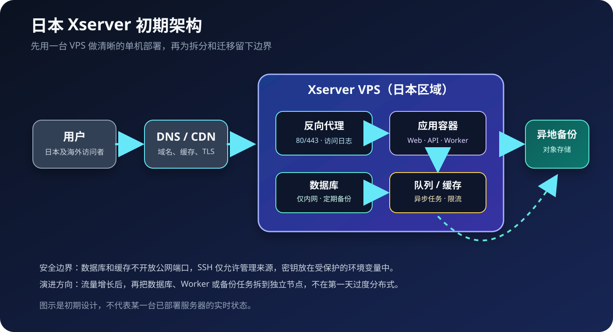

# 日本 Xserver 初期架构：先把边界搭对，再考虑扩容

如果目标是为日本用户提供一个稳定、容易维护的 Web 服务，初期最容易犯的错误不是“机器买小了”，而是第一天就把系统拆得太复杂：多个节点、多个编排系统、多个监控平台，最后没有人能说清楚一次请求经过了哪里。

更适合起步的方案是：选择日本区域的 Xserver VPS，把入口、应用、数据和备份划出清楚的边界，先用一台机器完成可观测、可恢复的单机部署。流量和团队规模真的增长后，再沿着这些边界拆分。

> 本文是一份初期架构设计，不代表某一台已部署服务器的实时状态。具体套餐、区域、带宽、磁盘和备份价格，应以 Xserver 官方页面和当前合同为准。

## 设计目标

这套架构先解决五件事：

1. 日本用户访问路径短，首屏延迟可控；
2. 公网只暴露必要的 Web 入口；
3. 应用、数据库和后台任务可以独立重启；
4. 数据有明确的备份位置和恢复流程；
5. 后续可以拆分，不必推倒重来。

它不追求第一天就做到多活、自动伸缩或完全无人值守。初期更重要的是“出了问题能找到原因，删错东西还能恢复”。

## 推荐的初始分层

### 1. DNS 与可选 CDN 层

域名先指向 DNS 服务。是否接 CDN，可以根据内容类型和访问范围决定：

- 静态资源、图片和公开页面适合缓存；
- 管理后台、登录接口和实时 API 不应盲目缓存；
- TLS 证书可以由入口代理自动续期，也可以使用云端代理提供的证书，但必须明确证书终止在哪里。

如果服务刚上线，先让 DNS、HTTPS 和健康检查稳定下来，比一开始配置复杂的缓存规则更重要。

### 2. Xserver VPS 入口层

VPS 上的第一层是反向代理，例如 Nginx、Caddy 或 Traefik。它负责：

- 监听 80/443；
- 自动或集中管理 TLS；
- 根据域名或路径转发到不同应用；
- 限制请求体大小、超时和上传类型；
- 记录访问日志，并把真实错误交给应用层处理。

公网不应该直接访问应用容器端口。入口代理和应用之间使用 Docker 网络或本机回环地址连接，数据库和缓存则只绑定内部网络。

### 3. 应用层：Web、API、Worker 分开

初期可以用 Docker Compose 管理一组容器，但在逻辑上把它们当作三个角色：

- **Web**：处理页面请求和轻量 API 请求；
- **Worker**：处理邮件、图片缩放、导入、报表等耗时任务；
- **定时任务**：执行清理、同步、备份和健康检查。

即使它们暂时运行在同一台 VPS 上，也不要把所有工作都塞进 Web 进程。这样做的好处是：某个导入任务卡住时，不会拖慢所有用户请求；以后需要扩容时，也可以只增加 Worker。

容器编排文件建议放在一个独立的部署目录中，生产环境的秘密通过受保护的环境变量或密钥管理机制注入，不写进 Git、镜像或公开文档。

### 4. 数据层：数据库和缓存只走内网

数据库是系统最需要保护的部分。初期可以和应用运行在同一台 VPS 上，但要保持几个硬规则：

- 不把数据库端口暴露到公网；
- 使用独立数据库用户和最小权限；
- 生产数据目录与应用代码目录分开；
- 定期执行逻辑备份，并实际做过一次恢复演练；
- 升级前先确认数据库版本、迁移脚本和回滚方案。

缓存或消息队列用于异步任务、限流和短期状态。它不是数据库的替代品，不能把唯一数据只放在缓存里。

## 一次请求如何经过系统

以访问 `https://example.jp/` 为例：

1. 用户通过 DNS 找到服务入口；
2. HTTPS 在 CDN 或 VPS 入口代理处终止；
3. 入口代理根据域名把请求转发给 Web 容器；
4. Web 容器读取数据库中的必要数据；
5. 耗时工作提交给 Worker 或队列，不阻塞页面响应；
6. 访问日志、应用日志和错误信息进入统一的日志位置；
7. 数据库备份按计划复制到异地存储。

这条路径应该能在文档中画出来，也应该能在机器上用日志和健康检查验证出来。无法解释的流量路径，就是未来排障的盲区。

## 网络和防火墙的最小规则

初期建议只开放：

| 端口 | 用途 | 建议 |
|---|---|---|
| 80 | HTTP 重定向或证书签发 | 允许公网访问 |
| 443 | HTTPS | 允许公网访问 |
| SSH 端口 | 管理 | 限制来源、使用密钥，禁止密码登录 |
| 数据库端口 | 数据库连接 | 不开放公网 |
| 缓存/队列端口 | 内部服务 | 不开放公网 |
| 管理面板端口 | 运维 | 通过 VPN、内网或 SSH 隧道访问 |

“端口没有监听”不等于“安全配置完成”。仍然要同时检查系统防火墙、云平台安全组、容器端口映射和反向代理路由，避免容器绕过入口层直接暴露。

## 备份：至少准备两种恢复路径

初期备份不需要复杂，但需要可恢复。建议分成两类：

### 快速恢复

用于机器故障或误删后的快速回滚：

- 应用部署文件和版本号；
- 数据库定期逻辑备份；
- 上传文件和必要的持久化目录；
- 近期配置快照。

### 异地恢复

用于 VPS 磁盘损坏、账号异常或整个区域不可用：

- 把备份复制到与 VPS 不同位置的对象存储或其他存储；
- 备份文件加密后再上传；
- 保留多个时间点，不要只保留“最新一份”；
- 定期在临时环境中恢复，确认备份真的能用。

备份任务的成功日志不能替代恢复测试。真正的验收标准是：拿一台干净机器，能不能根据文档重新启动服务并读到关键数据。

## 监控和日志的初期配置

不必一开始就建设复杂的可观测平台，但至少要能回答：

- VPS 的磁盘、内存、CPU 和网络是否接近上限；
- HTTP 健康检查是否返回预期状态；
- 容器是否重启或进入不健康状态；
- 数据库备份最近一次是否成功；
- 证书什么时候到期；
- 错误率和响应时间是否突然升高。

应用日志要区分访问日志、业务日志和异常日志。日志中不要写密码、Token、Cookie 或完整个人资料。保留周期也要有上限，避免磁盘被日志打满。

## 为什么不建议第一天就做高可用

单机架构当然有故障风险，但“多台机器”本身不等于高可用。没有数据复制、故障切换、健康检查和恢复演练时，多一台机器只会多一套需要维护的故障点。

初期更值得投入的是：

- 可重复的部署文件；
- 明确的备份和恢复命令；
- 可靠的健康检查；
- 最小权限和最小公网暴露面；
- 一次真实的故障演练。

等单机架构的边界稳定后，再按瓶颈拆分，通常比盲目追求“看起来像大公司”的拓扑更省钱、更可靠。

## 后续演进路线

当访问量、任务量或团队规模增长时，可以按下面的顺序演进：

### 阶段一：单 VPS + Compose

适合验证产品和早期用户。入口、应用、数据库、缓存和 Worker 在同一台 VPS 上，但容器职责分开，数据有异地备份。

### 阶段二：应用与数据库分离

当数据库 IO、内存或备份窗口成为瓶颈时，把数据库迁移到独立 VPS 或托管数据库。迁移前先确认网络延迟、备份恢复、连接池和版本兼容性。

### 阶段三：独立 Worker 与对象存储

当图片处理、导入、报表或 AI 任务占用大量 CPU 时，把 Worker 单独扩容；大文件和静态资源逐步迁移到对象存储或 CDN，减少应用节点的磁盘压力。

### 阶段四：多节点和故障切换

只有当业务确实需要更高可用性时，再引入多节点、负载均衡、数据库复制和自动故障切换。这个阶段的重点已经不是“把服务跑起来”，而是验证一致性、恢复时间和运维责任。

## 上线前检查清单

- [ ] 域名解析指向正确，HTTPS 证书有效；
- [ ] 只有必要端口开放，数据库和缓存没有公网映射；
- [ ] SSH 使用密钥，管理入口有来源限制；
- [ ] 应用、数据库、Worker 的容器职责清楚；
- [ ] 生产秘密不在 Git、镜像和公开文档中；
- [ ] 数据库备份已执行，并在干净环境恢复过；
- [ ] 健康检查、日志、磁盘告警可用；
- [ ] 有一份从零部署和故障恢复文档；
- [ ] 已确认 Xserver 当前套餐的带宽、磁盘、快照和备份能力。

## 小结

日本 Xserver 的初期架构不需要一开始就复杂。一个合理的起点是：日本区域 VPS 作为运行节点，反向代理作为唯一公网入口，Web/API/Worker 在应用层分工，数据库和缓存只走内网，备份复制到异地存储。

先把边界、备份和验证做对，再根据真实瓶颈扩容。这样既能快速上线，也不会把未来的迁移路堵死。

## 参考链接

- [Xserver 官方网站](https://www.xserver.ne.jp/)
- [XServer VPS 官方网站](https://vps.xserver.ne.jp/)
- [[hermes-agent/使用指南|Hermes Agent 使用指南]]
